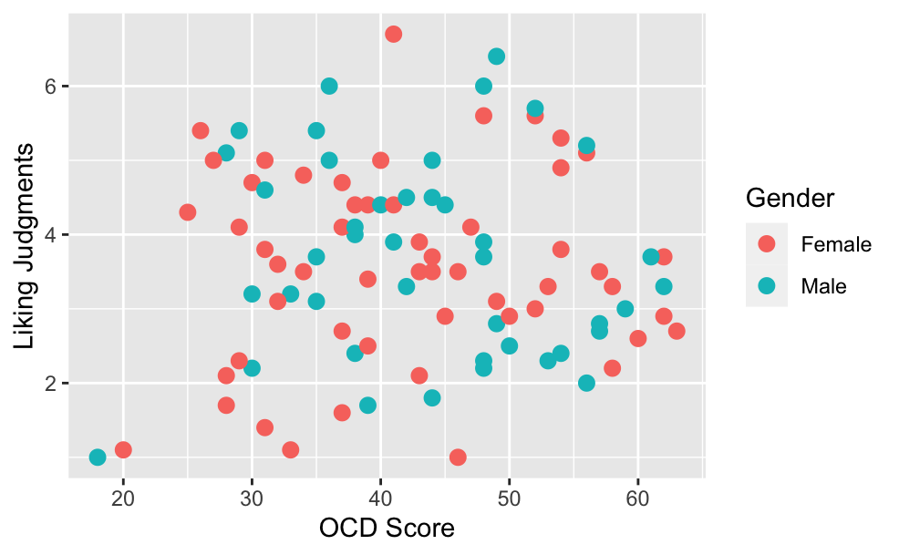
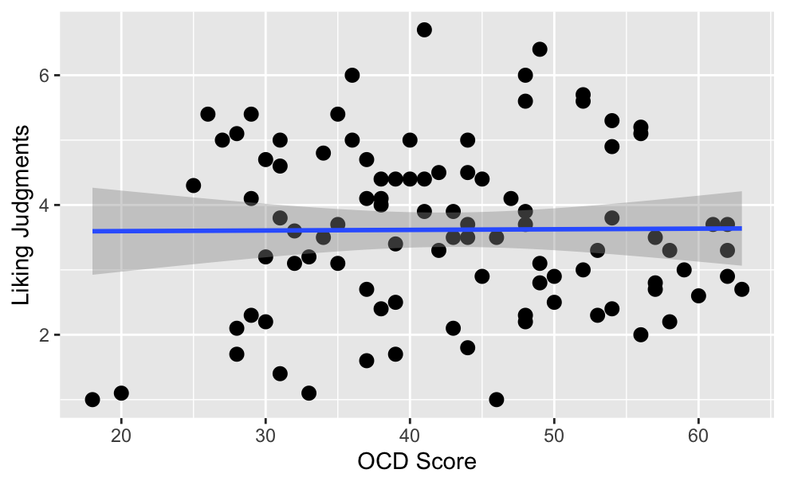
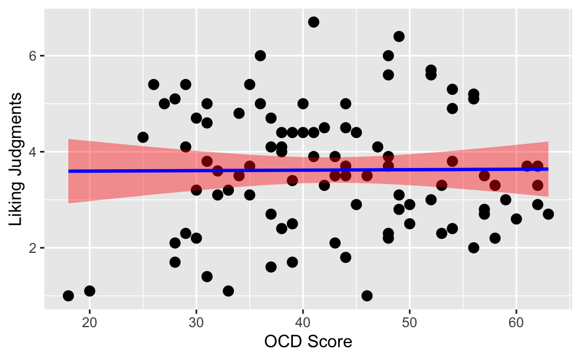
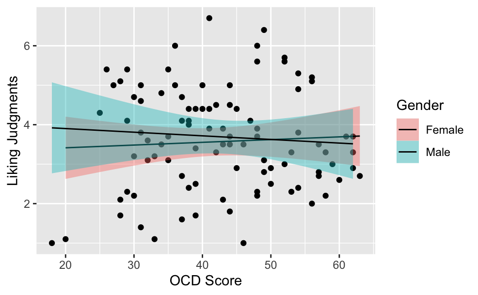
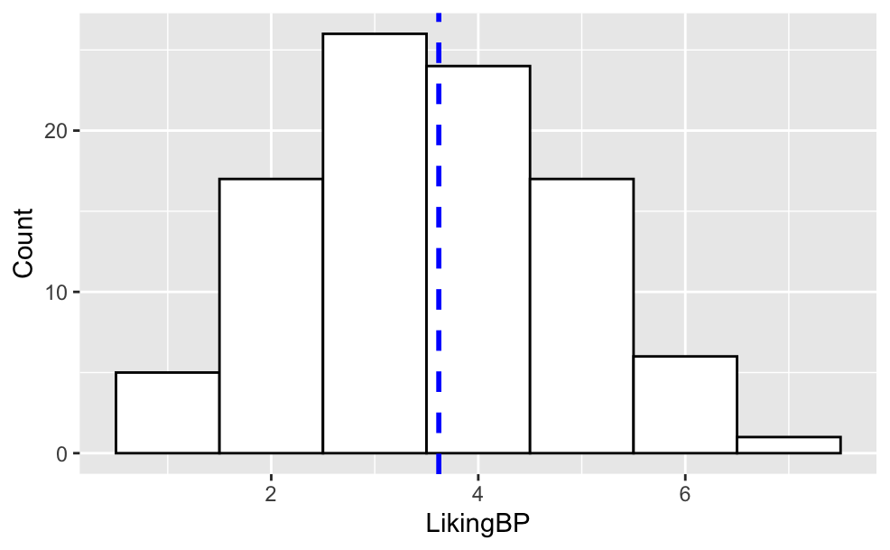
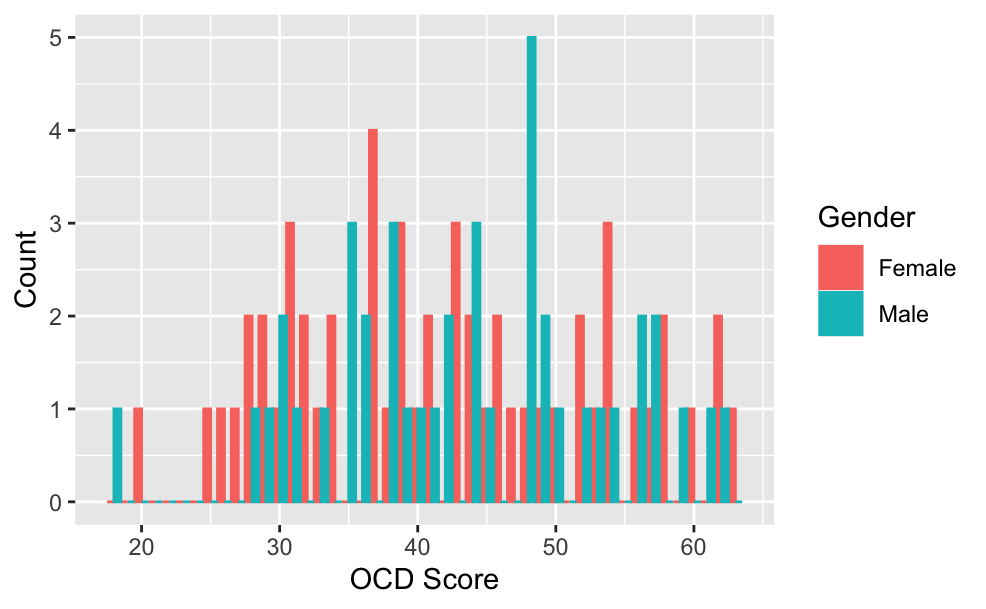

Basics Tutorial
================
Jordan Wylie
10/7/2020

# Basics of R Tutorial

This tutorial is to help new users get started with R with the goal of
analyzing data. This tutorial was specifically made for undergraduate
research assistants, but should be helpful for anyone looking to get
started with data analysis in R.

If your goal is to become literate in R programming language, there are
many other resources better suited to that goal.

For
    example:

  - <https://swirlstats.com/students.html>

  - <https://www.datacamp.com/courses/introduction-to-the-tidyverse>

  - <https://kiirstio.wixsite.com/kowen/post/the-25-days-of-christmas-an-r-advent-calendar>

This was created in RStudio (using RMarkdown).

R studio is an Integrated Development Environment (IDE) for R, you will
need to download both R and RStudio

Here is the link to R: <https://cran.rstudio.com/>

Here is the link to R Studio:
<https://rstudio.com/products/rstudio/download/#download>

# Getting started

The last portion of this tutorial (Section 7) utilizes a dataset that is
available on OSF. You can access it by request here:
<https://osf.io/3xmny/>. This is a work in progress. If you have any
questions, feedback, or concerns, please email me\!

Before we dive into the data. We will cover a few basics of the
language. Again, this is not exhaustive as covering all the parts of the
programming language is outside of the purview of this tutorial, and
resources to do that are readily available all over.

One short note: When you use the **\#** in a code block (or in your .r
file), this allows you to add comments to your code. This makes life a
whole lot easier because it is always true that your future self has no
idea what your past self was thinking or doing. Seriously. Use comments,
your future self will thank you. Additionally, R is case sensitive. Most
of the time, if your code won’t work, there is a typo of case error
hidden somewhere\!

# 0. The Set-up

This section has some set up functions that will be useful. For example,
using: `data <- read.csv(FILEHERE)` and then `colnames(data)` would take
a .csv and read it into R, then pull the variable names for you. I find
this part to be less intuitive, so if you are like me, you will get used
to it with practice.

### Packages: 

One reason that R is so useful for data analyses is because many of the things you need for them are already created for you in packages. This means that you can take advatage of the tools that developers have already put the time in to create. Almost anything you will need is out there somewhere (especially for more basic analyses), you just have to find it. This is another place that Google will come in handy.

IMPORTANT: One of the great things about R is that it is open source. That means that the packages are open source as well. They are hosted on CRAN, so when you try to install a package, it will search for it there. There are other ways of getting packages (e.g., if they are not on CRAN), but that is not something you will likely need to do and so it won't be covered here.

``` r
# You have to install the packages once to move them from
# CRAN to your R - so you can actually use them!

# install.packages(“readr”) # Will install the default
# location install.packages(“car”)
# install.packages(“tidyverse”) 
# install.packages(“psych”) 
# install.packages(“ggplot2”)
# install.packages(“lmtest”)
```

After you have downloaded the package, you have to use `library()` to read it in. So, first you have to download it from CRAN **one** time. Then, **every time** you need to use a given package that you have already installed on your local device, you need to use the `library()` command to load in the package for use. This seems straightforward, but new users often get confused about the differences between install and library. 

IMPORTANT: Sometimes you will see that the package contains a function that has the same name as a function from a different package. In this case, R you will see a warning message when you load the packages (this warning doesn't mean the load failed, just to let you know there is masking happening). The most recently loaded package will always be the one that masks functions from previously loaded packages, so the order that you load them does matter! But, sometimes it can't be avoided. In those cases you can call the package from which the function you intend to use comes from directly in your code to make sure it pulls the right version (you can unload the package you don't want). There will be an example of this in Section 7 (with the dplyr package).

``` r
#loading installed packages

library(readr)
library(car)
library(tidyverse)
library(psych)
library(ggplot2)
library(lmtest)
```
Now we will load in data. There are many ways to do this and many ways to read in different file types. We will be working with absolute paths (the exact file folder location of the downloaded data). But R supports working with relative paths as well (which is the gold standard for reproducible code). 

To set up your the working directory, you can use `setwd('C:/Users/NAME/LOCATION/')`. If you are not sure where you set up your RStudio to look, you will need to use `Sys.getenv('HOME')` to find where Home base is. Once you know where that is, you can remove the `HOME` directory part from your path, and replace it with `~` `setwd('~/Documents')`.

``` r
# Loading data - Accessing files from your working
# directory by file type.

# CSV (best way to save files!) 
# myData <- read.csv('FILENAME.csv')

# SPSS files!
library(foreign)
# MySPSSdata<- read.spss('FILENAME.sav')

# You can also load data straight from OSF, but we won't
# cover that right now

#Now we will actually download some data
# Downloading what we will need for the exercise at the end.
setwd("/Users/jordanwylie/Desktop/")  # Import data (csv file)/set this to wherever you downloaded the data from OSF.

dfAesth <- read.csv("Moral_Art_CleanRecode_VOSF.csv", header = T)
colnames(dfAesth)
```
Saving data: when you do things in R, they are not being written directly into your data file. This is actually really great! You will probably make (many) mistakes. Having your raw file untouched is useful so that you don't permanently mess anything up. But alas, there may be times when you do want to write things from R directly into your data file. For example, if you created a composite variable you can save new variable directly to the file. In this case, I recommend that you do not overwrite the original file, but create a new one instead.

``` r
# CSV write.csv(myData, 'FILENAME.csv')
```

# 1. The Calculator

You can use R like it’s just a big calculator. We will go through some of the basic calculator functions that R can handle. If you get used to the interface, I find R to be way easier to use than a traditional graphing calculator because you can easily edit (and see) the inputs!

``` r
# Addition
2 + 2
```

    ## [1] 4

``` r
# Subtraction
2 - 2
```

    ## [1] 0

``` r
# Multiplication
2 * 3
```

    ## [1] 6

``` r
# Division
2/3
```

    ## [1] 0.6666667

``` r
# Exponents
2^3
```

    ## [1] 8

``` r
# More complex operations
(2 + 2)/3
```

    ## [1] 1.333333

``` r
2 + (2/3)
```

    ## [1] 2.666667

``` r
# Other opeations

# Square root
sqrt(9)
```

    ## [1] 3

``` r
sqrt(x = 9)  #These are equivalent, in the first, the name is implicit
```

    ## [1] 3

``` r
# Round a number
round(x = 1.6180339887, digits = 0)  # Including the two arguments
```

    ## [1] 2

``` r
round(1.6180339887, 0)  # Equivalent, names implicit
```

    ## [1] 2

``` r
round(1.6180339887)  # With a default (where second argument is assumed to be 0-you should always check on this to make sure you know what arguments are being passed by defaults, and which ones you need to specify)
```

    ## [1] 2

``` r
round(3.6760698786, 4)  # Round Phi to the 4th decimal place
```

    ## [1] 3.6761

``` r
# log
log(2)  # Natural log
```

    ## [1] 0.6931472

``` r
log(2, base = 10)  # Log base 10
```

    ## [1] 0.30103

``` r
# e^x
exp(2)
```

    ## [1] 7.389056

``` r
exp(0.6931472)
```

    ## [1] 2

``` r
# Absolute value
abs(-2)
```

    ## [1] 2

``` r
abs(2)
```

    ## [1] 2

``` r
# Nested oepration
exp(log(2))  # These generally operate by requiring reading from the inside-out.
```

    ## [1] 2

# 2. The Logician

You can use R to evaluate logical statements (much like what people use excel for).

Here are the basics: 
* == equality
* != inequality
* < less than, > greater than 
* <= less than or equal to, >= greater than or equal to
* & AND 
* | OR 
* ! NOT

``` r

# Equality
2 + 2 == 5  
```

    ## [1] FALSE

``` r
# Inequality
2 + 2 != 5  
```

    ## [1] TRUE

``` r
5 != 1  
```

    ## [1] TRUE

``` r
# Greater than
5 > 1  
```

    ## [1] TRUE

``` r
# Greater than or equal to
5 >= 10  
```

    ## [1] FALSE

``` r
# Less than
5 < 1  
```

    ## [1] FALSE

``` r
# Less than or equal to
4 <= 5 
```

    ## [1] TRUE

# 3. Object assignment

Almost every operation in R uses objects. Objects are used to store
information, and often times, you will be able to think about objects as
variables. But objects are really flexible (functions, for example, can
be objects).

The pieces of information in objects are called “elements”. You “assign”
data to objects using the assignment operator `<-`. But, you can also
asign using the `=` sign (it is just not preferred). If you want
others to be able to read your code (i.e., reproducible code), you
should use `<-` to keep things clear.

``` r
myNumber <- 10
print(myNumber)
```

    ## [1] 10

``` r
myNumber  #does the same thing as print
```

    ## [1] 10

``` r
myNumber/2
```

    ## [1] 5

``` r
myNumber == 10
```

    ## [1] TRUE

``` r
myNumber <- 11
myNumber == 10  #my number was overwritten when I passed the new number to the object
```

    ## [1] FALSE


You can use any letter or word to represent your variable, list, object, etc. However, you want ot stay away from letters that have meaning already in math (this is true in MATLAB as well - i, j); for example, e already has a meaning, so you shouldn't use that.

``` r
### Vectors - vectors have magnitude and location
myObject <- c(1, 2, 9, 10)
myObject
```

    ## [1]  1  2  9 10

``` r
myObject/2
```

    ## [1] 0.5 1.0 4.5 5.0

``` r
# You can also give the elements in the object myVector names
myNewObject <- c(`time 1` = 1, `time 2` = 2, `time 3` = 9, `time 4` = 10)
myNewObject
```

    ## time 1 time 2 time 3 time 4 
    ##      1      2      9     10

You can also select and extract specific elements from objects in many ways, most basic is using square brackets `[]`
``` r
myObject[2]
```

    ## [1] 2

``` r
myNewObject[2]
```

    ## time 2 
    ##      2

``` r
# You can use : and c(X,X) to pull out a subset as well
myObject[1:3]
```

    ## [1] 1 2 9

``` r
myNewObject[c(1, 2)]
```

    ## time 1 time 2 
    ##      1      2

``` r
myObject[c(1, 4)]
```

    ## [1]  1 10

``` r
myNewObject[c(1, 4)]
```

    ## time 1 time 4 
    ##      1     10

``` r
### Vectors - vectors have magnitude and location. You can
### concatinate objects into a vector by forcing them together

myVector <- c(myObject, myNewObject)
myVector
```

    ##                             time 1 time 2 time 3 time 4 
    ##      1      2      9     10      1      2      9     10

# 4. More complex objects

You can use vectors (\#s with magnitude and direction), factors
(categorical variable, can have diff levels), matrices (vectors with
dimension), lists (object with many types (numbers,
strings,vectors,etc)), and data frames (a two dimensional data structure
in R), and more\!\!. We will explore a few of those below.

Note: Sometimes, you will need to figure out what object you created (so
that you can change it or figure out if it will work in a particular
function). To figure out the “class” of the object, you can use
`class()` and `str()`.

``` r
## Matrices + plus some manipualtion (to bind the rows =
## rbind(); to bind the columns = cbind())

mat1 <- matrix(1, nr = 2, nc = 2)
mat2 <- matrix(2, nr = 2, nc = 2)
rbind(mat1, mat2)
```

    ##      [,1] [,2]
    ## [1,]    1    1
    ## [2,]    1    1
    ## [3,]    2    2
    ## [4,]    2    2

``` r
cbind(mat1, mat2)
```

    ##      [,1] [,2] [,3] [,4]
    ## [1,]    1    1    2    2
    ## [2,]    1    1    2    2

``` r
## Lists - Lists are really useful because their elements are
## other objects. So, each element is its own object. Lists
## can get complicated and even contain other lists. We will
## only briefly cover lists here.

# Combine as elements in a list
myList <- list(myObject, myNewObject)
class(myList)
```

    ## [1] "list"

``` r
myList[[2]]
```

    ## time 1 time 2 time 3 time 4 
    ##      1      2      9     10

``` r
# The last class we will cover are dataframes. But we will
# come back to that in a bit!
```

# 5. Generating variables & functions

We will not go over much more of the basics, here is a brief intro into
variable creation and functions below. You already know how to use the object assignment operator to create variables (you made a bunch of objects in the previous section!). But in this section, you will see a few different ways to create variables that will come in handy for data analysis. You will also see the basic formula for creating a function yourself. 

``` r
# Create variables:
varname <- 1:30
varname1 <- seq(1, 5, 0.5)
# first number indicates the beginning of the sequence, the
# second one the end, and the third one the increment to be
# used to generate the sequence
varname2 <- seq(length = 9, from = 1, to = 5)
varname3 <- rep(1, 30)  #repeates a # for a length
varname4 <- rnorm(45, mean = 1, sd = 1)  #Gaussian (normal) random numbers

# Create a function:

# function (argist) {body}
species <- c("swallow", "bluebird", "cardinal")
# This is a list of string variables (much like the names of
# levels of a categorical variable!))
myfun <- function(thing) {
    print(thing)
}
myfun(species)
```

    ## [1] "swallow"  "bluebird" "cardinal"

# 6. Dataframes

Dataframes arrange columns together so that they look like a spreadsheet
would look. They are incredibly useful for data analysis for this reason
and are what you will liekly be using the most. Before we move on to new
data, we will explore dataframes using mtcars – one of R’s built-in
datasets.

``` r
class(mtcars)
head(mtcars)  # Displays 1st 6 rows 
tail(mtcars)  # Displays last 6 rows
colnames(mtcars)  # Get the variable names
# View(mtcars) # Opens the dataset so that you can preview it
# in RStudio

# Explore
mtcars[1]  # Single bracket keeps the rownames
mtcars[[1]]  # Double bracket just prints the elements

str(mtcars[1])
str(mtcars[[1]])

mtcars["mpg"]  # Single bracket keeps the rownames
mtcars[["mpg"]]  # Double bracket just prints the elements

str(mtcars["mpg"])
str(mtcars[["mpg"]])

## Using matrix notation
mtcars[, 1]  # [rows, columns]
str(mtcars[, 1])

# Matrix notation with names
mtcars[, "mpg"]  # [rows, columns]
str(mtcars[, "mpg"])

mtcars$mpg  # Just prints elements
str(mtcars$mpg)

# Matrix notation also means that you can access rows
mtcars[1, ]  # [rows, columns]
str(mtcars[1, ])

# By row names
mtcars["Mazda RX4", ]
str(mtcars["Mazda RX4", ])
```

# 7. Applying these concepts

We will now explore some pilot data using what we’ve learned. One reason
to do this is because often times the challenge for reserachers is not
in learning basic coding, but actually applying it to real data that is
messy. These data are not published yet and should not be shared without
permission.

    ##        x freq
    ## 1 Female   54
    ## 2   Male   42
    ## 3   <NA>    1


The operator %>% basically tells R to take the value of that which is to the left and pass it to the right as an argument. This operator will come in handy many times! It makes your code more succinct. However, you can geta round using it if you are not comfortable with it. 

``` r
#SUMMARIES
# detach(plyr) 
#This is how you would remove a package that you don't want to mask something

aesth.summaryBN <- dfAesth %>% # the names of the new data frame and the data frame to be summarized
  dplyr::group_by(Gender) %>%   #the grouping variable
  dplyr::summarise(mean_summBN = mean(LikingBN),  #calculates the mean by group
            sd_summBN = sd(LikingBN), #calculates the sd by group
            SE_summBN = parameters::standard_error(LikingBN)) # calculates se by group
```

    ## `summarise()` ungrouping output (override with `.groups` argument)

``` r
aesth.summaryBN <- aesth.summaryBN[-c(3),] #remove the NA row
aesth.summaryBN
```

    ## # A tibble: 2 x 4
    ##   Gender mean_summBN sd_summBN SE_summBN
    ##   <fct>        <dbl>     <dbl>     <dbl>
    ## 1 Female        3.54      1.11     0.151
    ## 2 Male          3.73      1.07     0.165

``` r
aesth.summaryBP <- dfAesth %>% 
 dplyr::group_by(Gender) %>%   
 dplyr::summarise(mean_summBP = mean(LikingBP), 
            sd_summBP = sd(LikingBP), 
            SE_summBP = parameters::standard_error(LikingBP))
```

    ## `summarise()` ungrouping output (override with `.groups` argument)

``` r
aesth.summaryBP <- aesth.summaryBP[-c(3),] #remove the NA row
aesth.summaryBP
```

    ## # A tibble: 2 x 4
    ##   Gender mean_summBP sd_summBP SE_summBP
    ##   <fct>        <dbl>     <dbl>     <dbl>
    ## 1 Female        3.57      1.28     0.174
    ## 2 Male          3.69      1.34     0.207

``` r
#CORRELATIONS
corVar1 <- dfAesth[,c("LikingBP","LikingBN","OCDIndex")]
corrVarMat <- lowerCor(corVar1)
```

    ##          LknBP LknBN OCDIn
    ## LikingBP 1.00             
    ## LikingBN 0.57  1.00       
    ## OCDIndex 0.01  0.13  1.00

``` r
corr.test(corVar1) # use = "pairwise",method="pearson",adjust="holm", default is "pairwise"
```

    ## Call:corr.test(x = corVar1)
    ## Correlation matrix 
    ##          LikingBP LikingBN OCDIndex
    ## LikingBP     1.00     0.57     0.01
    ## LikingBN     0.57     1.00     0.13
    ## OCDIndex     0.01     0.13     1.00
    ## Sample Size 
    ## [1] 97
    ## Probability values (Entries above the diagonal are adjusted for multiple tests.) 
    ##          LikingBP LikingBN OCDIndex
    ## LikingBP      0.0     0.00     0.90
    ## LikingBN      0.0     0.00     0.42
    ## OCDIndex      0.9     0.21     0.00
    ## 
    ##  To see confidence intervals of the correlations, print with the short=FALSE option

``` r
#REGRESSIONS
model1 <- lm(LikingBP ~ OCDIndex, data = dfAesth)
summary(model1)
```

    ## 
    ## Call:
    ## lm(formula = LikingBP ~ OCDIndex, data = dfAesth)
    ## 
    ## Residuals:
    ##      Min       1Q   Median       3Q      Max 
    ## -2.62871 -0.94585 -0.00689  0.87753  3.07908 
    ## 
    ## Coefficients:
    ##             Estimate Std. Error t value Pr(>|t|)    
    ## (Intercept) 3.557030   0.547689   6.495 3.79e-09 ***
    ## OCDIndex    0.001558   0.012419   0.125      0.9    
    ## ---
    ## Signif. codes:  0 '***' 0.001 '**' 0.01 '*' 0.05 '.' 0.1 ' ' 1
    ## 
    ## Residual standard error: 1.304 on 95 degrees of freedom
    ## Multiple R-squared:  0.0001657,  Adjusted R-squared:  -0.01036 
    ## F-statistic: 0.01574 on 1 and 95 DF,  p-value: 0.9004

``` r
model2 <- lm(LikingBN ~ OCDIndex, data = dfAesth)
summary(model2)
```

    ## 
    ## Call:
    ## lm(formula = LikingBN ~ OCDIndex, data = dfAesth)
    ## 
    ## Residuals:
    ##     Min      1Q  Median      3Q     Max 
    ## -2.5068 -0.7508  0.1194  0.7528  2.0455 
    ## 
    ## Coefficients:
    ##             Estimate Std. Error t value Pr(>|t|)    
    ## (Intercept)  3.07478    0.45780   6.716 1.36e-09 ***
    ## OCDIndex     0.01309    0.01038   1.261     0.21    
    ## ---
    ## Signif. codes:  0 '***' 0.001 '**' 0.01 '*' 0.05 '.' 0.1 ' ' 1
    ## 
    ## Residual standard error: 1.09 on 95 degrees of freedom
    ## Multiple R-squared:  0.01647,    Adjusted R-squared:  0.006115 
    ## F-statistic: 1.591 on 1 and 95 DF,  p-value: 0.2103

# 8. Visualizations

Here we will go thru creation of a basic scatterplot. All code PRECEDES
the respective figure.

``` r
# Create a scatterplot with OCD on the x-axis and Liking BP
# on the y-axis

# remove the one person who selected gender other than male
# and female for visualization
dfAesth <- dfAesth[!is.na(dfAesth$Gender), ]

# Example:
scatter1 <- ggplot(aes(OCDIndex, LikingBP), data = dfAesth)
scatter1 + geom_point(aes(colour = Gender), shape = 16, size = 3) + 
    labs(x = "OCD Score", y = "Liking Judgments")
```

<!-- -->

``` r
# Add a regression line to the scatterplot:
scatter1 + geom_point(shape = 16, size = 3) + geom_smooth(method = "lm") + 
    labs(x = "OCD Score", y = "Liking Judgments")
```

    ## `geom_smooth()` using formula 'y ~ x'

<!-- -->

``` r
# Add the 95% confidence interval
scatter1 + geom_point(shape = 16, size = 3) + geom_smooth(method = "lm", 
    colour = "blue", fill = "red") + labs(x = "OCD Score", y = "Liking Judgments")
```

    ## `geom_smooth()` using formula 'y ~ x'

<!-- -->

## 8.1 Visualizations 

Adding regression lines by Gender.

``` r
# Create a new scatterplot with separate regression lines for
# women and men:
scatter2 <- ggplot(aes(OCDIndex, LikingBP), data = dfAesth) + 
    geom_point() + geom_smooth(method = "lm", aes(fill = Gender), 
    colour = "black", size = 0.5) + labs(x = "OCD Score", y = "Liking Judgments")
scatter2
```

    ## `geom_smooth()` using formula 'y ~ x'

<!-- -->

## 8.2 Visualizations - Histograms

Creating a histogram with the mean included.

``` r
# Create a histogram showing the distribution of liking.
histogram1 <- ggplot(aes(LikingBP), data = dfAesth) + geom_histogram(binwidth = 1, 
    color = "black", fill = "white") + labs(x = "LikingBP", y = "Count")

# Add a line for the mean to the histogram:
histogram1 + geom_vline(aes(xintercept = mean(LikingBP)), color = "blue", 
    linetype = "dashed", size = 1)
```

<!-- -->

# 8.2.1 Visualizations with grouping

Histogram grouped by Gender.

``` r
# Group histogram by gender:

histogram2 <- ggplot(aes(OCDIndex), data = dfAesth) + geom_histogram(binwidth = 1, 
    color = "black", fill = "white") + labs(x = " OCD Score ", 
    y = "Count")

histogram2 <- ggplot(aes(OCDIndex, colour = Gender, fill = Gender), 
    data = dfAesth) + geom_histogram(binwidth = 1, position = "dodge") + 
    labs(x = "OCD Score", y = "Count")

histogram2
```

<!-- -->
